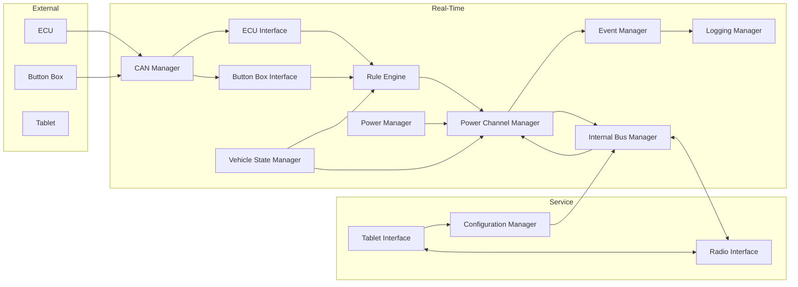

# DCC Data Flow

**Document ID:** DCC-ARCH-FLOW-001  
**Version:** 1.0  
**Status:** Proposed  
**Work Package:** WP-005

## 1. Purpose

Describe how information flows between DCC internal modules and external nodes. Classifies data by type without specifying implementation buffers or APIs.

## 2. Data categories

| Category | Description | Latency target | Persistence |
|----------|-------------|----------------|-------------|
| **Commands** | Imperative requests (enable output, apply config, OTA chunk) | Immediate **TBD** | No |
| **Events** | Asynchronous notifications (fault, mode change, input) | ms **TBD** | Optional via Logging |
| **Configuration** | Vehicle behaviour definition | On apply | Persistent |
| **Diagnostics** | Health snapshots, fault registers | On request / periodic **TBD** | Partial |
| **Telemetry** | Cyclic state (mode, currents, ECU cache) | 20–50 ms **TBD** | No (stream) |
| **Persistent data** | Logs, config blobs, counters | Write-through **TBD** | Yes |
| **Timing** | Ticks, deadlines, timestamps | Continuous | No |

## 3. High-level flow



## 4. Commands

| Source | Destination | Command type | Path |
|--------|-------------|--------------|------|
| Rule Engine | Power Channel Manager | `output_on` / `output_off` / PWM duty | Internal |
| Vehicle State Manager | Power Channel Manager | Mode baseline permissions | Internal |
| Configuration Manager | Internal Bus Manager | CONFIG_LOAD | DCPI |
| Tablet Interface | Configuration Manager | PUT /config, POST /apply | REST |
| Firmware Update Manager | Internal Bus Manager | OTA_BEGIN, OTA_CHUNK | DCPI |
| Tablet Interface | Internal Bus Manager | OUTPUT_TEST **TBD** | DCPI via Service |
| Diagnostics external | Power Channel Manager | Test enable **TBD** | DCP COMMAND |

Commands affecting safety **shall** pass through Power Manager enable gate (DC-DCC-ARCH-001).

## 5. Events

| Publisher | Event | Subscribers (typical) |
|-----------|-------|---------------------|
| Vehicle State Manager | `VEHICLE_MODE_CHANGED` | Rule Engine, Power Channel Manager, Logging, Radio mirror |
| Power Channel Manager | `CHANNEL_FAULT` | Diagnostics, Event Manager, Logging, Power Manager **TBD** |
| ECU Interface | `ECU_TELEMETRY_UPDATED` | Rule Engine |
| Button Box Interface | `INPUT_EVENT` | Rule Engine, VSM **TBD** |
| CAN Manager | `CAN_NODE_TIMEOUT` | ECU/Button Box Interface, Diagnostics |
| Internal Bus Manager | `INTERNAL_BUS_TIMEOUT` | Power Manager, Watchdog, Diagnostics |
| Configuration Manager | `CONFIG_APPLIED` | Rule Engine, Power Channel Manager, VSM, Logging |
| Watchdog Manager | `WATCHDOG_FAULT` | Power Manager, Diagnostics, Logging |

Full event taxonomy: [DCC_Event_Model.md](DCC_Event_Model.md).

## 6. Configuration flow

```
Tablet/UI or file
    → Configuration Manager (validate, compile)
    → DCPI CONFIG_LOAD
    → Internal Bus Manager
    → Persistent Storage (active FRAM) **TBD**
    → CONFIG_APPLIED event
    → Rule Engine + Power Channel Manager + VSM reload
```

Active config authority remains on Real-Time after apply (DC-DCC-ARCH-003).

## 7. Diagnostics flow

```
Power Channel Manager / modules
    → Diagnostics Manager (aggregate)
    → CAN DIAGNOSTIC TX **TBD**
    → DCPI STATE_PUSH (fault summary)
    → Radio Interface
    → Tablet GET /status, /outputs
```

## 8. Telemetry flow

| Stream | Path | Rate |
|--------|------|------|
| DCC system telemetry | RT → CAN TELEMETRY | 50 ms per 004 |
| Channel pack | RT → CAN | 50 ms **TBD** |
| STATE_PUSH | RT → DCPI → Service | 50 ms per 004 |
| WebSocket JSON | Service → Tablet | 20 Hz per 004 |

STM32 does not build JSON; Service assembles from binary STATE_PUSH.

## 9. Persistent data flow

| Data | Writer | Storage | Reader |
|------|--------|---------|--------|
| Active DCFG | Configuration Manager | FRAM **TBD** | RT modules at boot |
| Config backup | Configuration Manager | Flash **TBD** | Recovery |
| Event log | Logging Manager | FRAM ring + Flash archive | Tablet export |
| OTA image | Firmware Update Manager | Flash partition **TBD** | Bootloader |

## 10. Timing information flow

| Producer | Consumer | Use |
|----------|----------|-----|
| Time Base | All modules | Timestamps, timeouts |
| Time Base | CAN Manager | Heartbeat 100 ms / 500 ms loss |
| Time Base | Internal Bus Manager | SPI 100 ms timeout |
| Time Base | Rule Engine | Prime duration **TBD** |
| Time Base | Event Manager | Rate limiting |

## 11. External node data flow

### ECU

```
ECU --ENGINE_TELEM/COOLING_REQ--> CAN --> ECU Interface --cache--> Rule Engine
DCC --VEHICLE_MODE/DIAG--> CAN --> ECU (optional)
```

### Button Box

```
Button Box --EVENT--> CAN --> Button Box Interface --INPUT_EVENT--> Rule Engine
```

### Tablet

```
Tablet <--WS/REST-- Tablet Interface <--STATE_PUSH-- Radio Interface <--DCPI-- RT
Tablet --PUT config--> Configuration Manager --DCPI--> RT
```

## 12. Related documents

- [DCC_Service_Model.md](DCC_Service_Model.md)
- [DCC_Event_Model.md](DCC_Event_Model.md)
- [docs/004_Communication_Protocol.md](../004_Communication_Protocol.md)
- [docs/005_Configuration_Model.md](../005_Configuration_Model.md)

## 13. Revision history

| Version | Date | Change |
|---------|------|--------|
| 1.0 | 2026-07-12 | WP-005 data flow |
