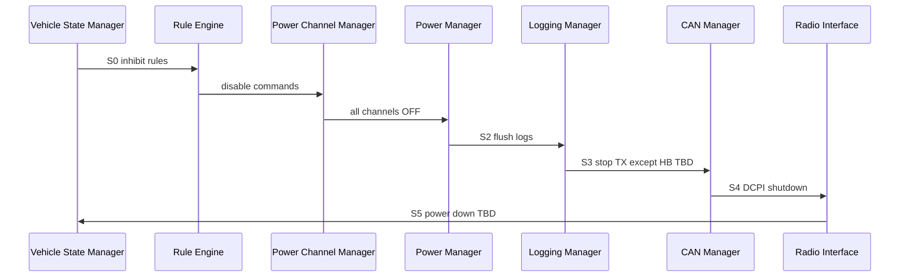

# DCC Shutdown Sequence

**Document ID:** DCC-ARCH-SHUTDOWN-001  
**Version:** 1.0  
**Status:** Proposed  
**Work Package:** WP-005

## 1. Purpose

Define logical controlled shutdown order for DCC. Complements fail-safe immediate disable paths (kill, watchdog, SPI timeout).

Requirements: DC-DCC-ARCH-022.

## 2. Shutdown triggers

| Trigger | Type | Controlled sequence applicable |
|---------|------|------------------------------|
| VCM transition to OFF | Normal | Yes |
| Master contactor open | Normal | Partial **TBD** |
| Kill switch | Emergency | No — immediate hardware path |
| Watchdog reset | Fault | No — hardware reset |
| SPI / Internal bus timeout | Fault | No — immediate global disable |
| OTA reboot request | Maintenance | Yes **TBD** |
| Operator REST reboot **TBD** | Service | Yes **TBD** |

## 3. Shutdown phases

| Phase | Name | Goal |
|-------|------|------|
| S0 | Inhibit new work | Stop enables and rule firing |
| S1 | De-energize outputs | All channels safe state |
| S2 | Flush persistence | Complete log/config writes |
| S3 | Stop field buses | CAN graceful **TBD** |
| S4 | Stop Service | DCPI and REST down |
| S5 | Stop Real-Time | Prepare reset or sleep **TBD** |

## 4. Sequence

## 5. Per-subsystem shutdown

### S0 — Vehicle State Manager

| Action | Defer new mode transitions except OFF; publish `VEHICLE_MODE_CHANGED` |
| Failure | Force OFF **TBD** |
| Safe state | Mode OFF |

### S0 — Rule Engine

| Action | Cease evaluation; cancel pending actions |
| Failure | Power Channel Manager ignores rule commands |
| Safe state | Mode table only |

### S1 — Power Channel Manager

| Action | All channels → Ready or Disabled de-energized; cancel PWM |
| Timeout | **TBD** per channel class |
| Failure | Power Manager withdraws global enable |
| Safe state | No load current |

### S1 — Power Manager

| Action | Assert global enable false |
| Failure | Hardware kill chain still applies |
| Safe state | Outputs OFF |

### S2 — Logging Manager + Persistent Storage

| Action | Flush ring buffer to archive **TBD**; complete pending writes |
| Timeout | **TBD** |
| Failure | Log `LOG_STORAGE_FULL` / `STORAGE_ERROR`; continue shutdown |
| Safe state | Best-effort persistence |

### S3 — CAN Manager

| Action | Send final HEARTBEAT state **TBD**; cease application TX |
| Timeout | **TBD** |
| Failure | Bus silence acceptable |
| Safe state | Listeners off |

### S3 — ECU / Button Box Interfaces

| Action | Mark nodes inactive; stop cache updates |
| Safe state | Stale cache discarded on next boot |

### S4 — Tablet Interface + Radio Interface

| Action | Close WS; refuse REST except status **TBD**; DCPI graceful stop |
| Timeout | **TBD** |
| Failure | RT already safe |
| Safe state | Service offline |

### S4 — Configuration Manager

| Action | Reject new apply; complete in-flight apply or rollback **TBD** |
| Safe state | Active config unchanged mid-apply |

### S5 — Internal Bus Manager

| Action | Cease SPI transactions; tri-state **TBD** |
| Safe state | Power board failsafe OFF |

### S5 — Watchdog Manager

| Action | Final kick or intentional hold for reset **TBD** |
| Safe state | Ready for power removal or reset |

## 6. Emergency shutdown

Kill switch and hardware enable chain bypass S0–S4 software ordering where architecture requires immediate OFF (docs/001 §9). Software shall still attempt log flush if time permits **TBD** — **ADR**.

## 7. Cool-down shutdown

COOL_DOWN mode may keep cooling channels enabled before full OFF per VCM config. Transition COOL_DOWN → OFF follows this sequence for remaining channels only.

## 8. Related documents

- [DCC_StartUp_Sequence.md](DCC_StartUp_Sequence.md)
- [DCC_Fault_Handling.md](DCC_Fault_Handling.md)
- [Power_Channel_State_Model.md](Power_Channel_State_Model.md)

## 9. Revision history

| Version | Date | Change |
|---------|------|--------|
| 1.0 | 2026-07-12 | WP-005 shutdown sequence |
