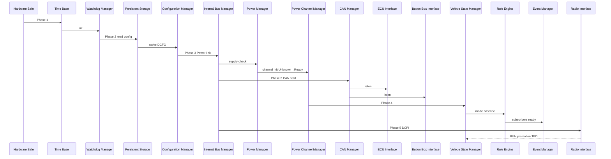

# DCC Start-Up Sequence

**Document ID:** DCC-ARCH-BOOT-001  
**Version:** 1.0  
**Status:** Proposed  
**Work Package:** WP-005

## 1. Purpose

Define logical initialization order for DCC subsystems. Describes dependencies, timeouts, failure behaviour, retry policy, and safe state — **no boot code**.

Requirements: DC-DCC-ARCH-021, 023, 025.

## 2. Phases overview

| Phase | Name | Domain |
|-------|------|--------|
| 0 | Hardware safe state | Hardware (outputs OFF) |
| 1 | Foundation | RT |
| 2 | Storage and config | RT + SVC |
| 3 | Field buses | RT |
| 4 | Application modules | RT |
| 5 | Service bring-up | SVC |
| 6 | RUN | RT + SVC |

## 3. Sequence diagram



## 4. Per-subsystem initialization

### Phase 0 — Hardware safe state

| Field | Value |
|-------|-------|
| **Initialization** | Outputs de-energized; global enable inactive; kill chain evaluated |
| **Dependency** | Power-on reset or wake |
| **Timeout** | N/A |
| **Failure behaviour** | Remain OFF |
| **Retry policy** | N/A |
| **Safe state** | All channels OFF |

### 1. Time Base

| Field | Value |
|-------|-------|
| **Initialization** | Start monotonic tick; capture reset reason if available |
| **Dependency** | Phase 0 |
| **Timeout** | **TBD** |
| **Failure behaviour** | Abort boot → Phase 0 safe |
| **Retry policy** | None |
| **Safe state** | Outputs OFF |

### 2. Watchdog Manager

| Field | Value |
|-------|-------|
| **Initialization** | Arm hardware watchdog **TBD**; register reset reason |
| **Dependency** | Time Base |
| **Timeout** | **TBD** |
| **Failure behaviour** | Log `RESET_DETECTED`; continue if non-fatal **TBD** |
| **Retry policy** | N/A |
| **Safe state** | WDT armed; outputs OFF |

### 3. Persistent Storage Manager

| Field | Value |
|-------|-------|
| **Initialization** | Probe FRAM/Flash; CRC active config |
| **Dependency** | Time Base |
| **Timeout** | **TBD** |
| **Failure behaviour** | `STORAGE_CORRUPT` → attempt backup blob **TBD** |
| **Retry policy** | Read retry **TBD** |
| **Safe state** | Outputs OFF; no config apply |

### 4. Event Manager

| Field | Value |
|-------|-------|
| **Initialization** | Empty subscriber tables |
| **Dependency** | Time Base |
| **Timeout** | N/A |
| **Failure behaviour** | Boot abort **TBD** |
| **Retry policy** | N/A |
| **Safe state** | Outputs OFF |

### 5. Internal Bus Manager — Power leg

| Field | Value |
|-------|-------|
| **Initialization** | Establish SPI to Power board; verify BOARD_ID **TBD** |
| **Dependency** | Watchdog, Time Base |
| **Timeout** | **100 ms** per architecture reference |
| **Failure behaviour** | `INTERNAL_BUS_TIMEOUT` → global disable |
| **Retry policy** | **TBD** retries then latch boot fault |
| **Safe state** | Outputs OFF |

### 6. Power Manager

| Field | Value |
|-------|-------|
| **Initialization** | Read supply sense; evaluate kill/master FB; withhold global enable |
| **Dependency** | Internal Bus Manager |
| **Timeout** | **TBD** |
| **Failure behaviour** | Global enable denied; log UV/OV **TBD** |
| **Retry policy** | Supply retry window **TBD** |
| **Safe state** | Global enable false |

### 7. Configuration Manager (RT apply path)

| Field | Value |
|-------|-------|
| **Initialization** | Load active DCFG from storage; validate CRC/version |
| **Dependency** | Persistent Storage, Internal Bus |
| **Timeout** | **TBD** |
| **Failure behaviour** | `CONFIG_FAILED`; use last-good or safe minimal **TBD** |
| **Retry policy** | Backup blob once **TBD** |
| **Safe state** | Default all outputs disabled in config |

### 8. Power Channel Manager

| Field | Value |
|-------|-------|
| **Initialization** | All channels → Unknown then Ready; no enable |
| **Dependency** | Configuration apply, Power Manager |
| **Timeout** | **TBD** |
| **Failure behaviour** | Channel remains Disabled |
| **Retry policy** | N/A |
| **Safe state** | Ready (de-energized) |

### 9. CAN Manager

| Field | Value |
|-------|-------|
| **Initialization** | Start CAN FD controller; enter bus active |
| **Dependency** | Time Base |
| **Timeout** | Bus-off recovery **TBD** |
| **Failure behaviour** | `COMMS_DEGRADED`; continue RT without CAN **ADR** |
| **Retry policy** | Bus recovery **TBD** |
| **Safe state** | TX HEARTBEAT only |

### 10. ECU Interface + Button Box Interface

| Field | Value |
|-------|-------|
| **Initialization** | Empty cache; mark nodes UNKNOWN |
| **Dependency** | CAN Manager, Configuration |
| **Timeout** | Discovery window **2 s** per 004 |
| **Failure behaviour** | Nodes LOST until heartbeat |
| **Retry policy** | Continuous supervision |
| **Safe state** | No ECU-dependent rules until PRESENT **TBD** |

### 11. Diagnostics Manager + Logging Manager

| Field | Value |
|-------|-------|
| **Initialization** | Clear transient diag; attach log buffer |
| **Dependency** | Persistent Storage, Event Manager |
| **Timeout** | **TBD** |
| **Failure behaviour** | Degraded logging only |
| **Retry policy** | Storage retry **TBD** |
| **Safe state** | RT control unaffected |

### 12. Vehicle State Manager

| Field | Value |
|-------|-------|
| **Initialization** | Mode → OFF or MASTER_ON per inputs **TBD** |
| **Dependency** | Configuration, ECU Interface **TBD** |
| **Timeout** | **TBD** |
| **Failure behaviour** | Remain OFF |
| **Retry policy** | N/A |
| **Safe state** | OFF |

### 13. Rule Engine

| Field | Value |
|-------|-------|
| **Initialization** | Load rules; no fire until RUN |
| **Dependency** | VSM, Configuration, ECU/Button Box interfaces |
| **Timeout** | N/A |
| **Failure behaviour** | Disable rules; mode table only |
| **Retry policy** | Re-init on CONFIG_APPLIED |
| **Safe state** | No rule-driven enables |

### 14. Communication Manager

| Field | Value |
|-------|-------|
| **Initialization** | Bind CAN and internal gateways |
| **Dependency** | CAN Manager, Internal Bus |
| **Timeout** | **TBD** |
| **Failure behaviour** | Partial gateway **TBD** |
| **Retry policy** | **TBD** |
| **Safe state** | RT local control |

### 15. Radio Interface + Service stack (parallel)

| Field | Value |
|-------|-------|
| **Initialization** | ESP32 boot; DCPI sync; REST listener |
| **Dependency** | Internal Bus DCPI leg |
| **Timeout** | DCPI PING **TBD** |
| **Failure behaviour** | RT continues; Service offline |
| **Retry policy** | DCPI reconnect periodic **TBD** |
| **Safe state** | RT RUN without UI |

### 16. RUN promotion

| Field | Value |
|-------|-------|
| **Initialization** | DCC HEARTBEAT RUN; begin telemetry |
| **Dependency** | All critical RT modules **TBD** checklist |
| **Timeout** | N/A |
| **Failure behaviour** | Remain INIT or DEGRADED **TBD** |
| **Retry policy** | N/A |
| **Safe state** | Channels only enable per VCM+rules |

## 5. Boot dependency graph (summary)

```
Phase 0 → Time Base → Watchdog → Persistent Storage
              → Event Manager
              → Internal Bus (Power) → Power Manager → Power Channel Manager
              → CAN Manager → ECU/Button Box Interfaces
              → Configuration apply → VSM → Rule Engine
              → Diagnostics / Logging
              → Internal Bus (DCPI) → Radio / Configuration Service
              → RUN
```

## 6. Unexpected restart

Treat as Phase 0 + full sequence. Reset reason from Watchdog Manager shall be logged (DC-DCC-ARCH-023).

## 7. Related documents

- [DCC_Shutdown_Sequence.md](DCC_Shutdown_Sequence.md)
- [DCC_Fault_Handling.md](DCC_Fault_Handling.md)
- [docs/004_Communication_Protocol.md](../004_Communication_Protocol.md) §8

## 8. Revision history

| Version | Date | Change |
|---------|------|--------|
| 1.0 | 2026-07-12 | WP-005 startup sequence |
