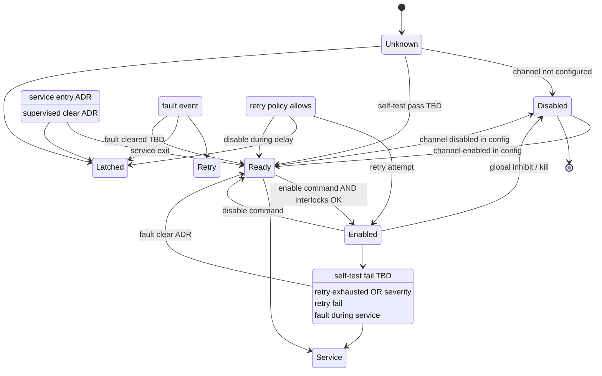

# DCC Power Channel State Model

**Document ID:** DCC-PWR-STATE-001  
**Version:** 1.0  
**Status:** Proposed  
**Work Package:** WP-004

Generic per-channel state machine for DCC power outputs. Describes states and allowed transitions only — **no algorithms**.

Requirements: [Power_Channel_Requirements.md](Power_Channel_Requirements.md) § state (DC-DCC-PWR-041–060).

---

## 1. Purpose

Provide a uniform behavioural model for all channel classes (HC-A through BD-A) so firmware, diagnostics, and configuration use consistent semantics.

## 2. States

| State | Description |
|-------|-------------|
| **Disabled** | Channel administratively unavailable (config, hardware missing, or global inhibit). No energization permitted. |
| **Ready** | Channel available; may accept enable command when VCM and interlocks permit. Output de-energized. |
| **Enabled** | Output energized per command (on, PWM, or direction). Normal operation. |
| **Fault Detected** | Transient fault observed (overcurrent, short, open load, thermal, communication). Output de-energized or limited per policy **TBD**. |
| **Retry Delay** | Waiting before automatic re-enable attempt after Fault Detected. Timer duration **TBD**. |
| **Latched Fault** | Persistent fault; automatic retry exhausted or severity requires manual intervention. Output de-energized. |
| **Service Mode** | Maintenance state allowing supervised test energization — entry/exit **ADR**. Overrides normal VCM **TBD**. |
| **Unknown** | Initial state after reset or when diagnostics cannot classify channel health. Treated as fail-safe OFF. |

## 3. State diagram

## 4. Allowed transitions

| From | To | Condition (abstract) |
|------|-----|----------------------|
| Unknown | Ready | Channel configured; health check pass **TBD** |
| Unknown | Disabled | Channel not present in hardware config |
| Unknown | Latched Fault | Power-on self-test failure **TBD** |
| Disabled | Ready | Configuration enables channel |
| Ready | Enabled | Valid enable; `nENABLE_GLOBAL` active; VCM permits; no active latch |
| Ready | Disabled | Configuration disables channel |
| Ready | Service Mode | **ADR** — authorized service entry |
| Enabled | Ready | Disable command or VCM transition requires off |
| Enabled | Fault Detected | Protection or diagnostic fault |
| Enabled | Disabled | Global kill / SPI timeout / MCU fail-safe |
| Fault Detected | Retry Delay | `retry_count` remaining > 0 |
| Fault Detected | Latched Fault | Retries exhausted or non-retryable fault class **TBD** |
| Fault Detected | Ready | Fault condition cleared without retry **TBD** |
| Retry Delay | Enabled | Delay elapsed; retry attempt |
| Retry Delay | Latched Fault | Retry attempt fails |
| Retry Delay | Ready | Disable received during delay |
| Latched Fault | Ready | Authorized fault clear |
| Latched Fault | Service Mode | **ADR** — supervised test |
| Service Mode | Ready | Service session end |
| Service Mode | Latched Fault | Fault during service |

## 5. Prohibited transitions

| Transition | Reason |
|------------|--------|
| Latched Fault → Enabled (direct) | SHALL require Ready intermediate or Service Mode per DC-DCC-PWR-052 |
| Disabled → Enabled (direct) | SHALL pass through Ready |
| Unknown → Enabled (direct) | Fail-safe — DC-DCC-PWR-042 |
| Any → Enabled when global kill inactive | Interlock violation — DC-DCC-PWR-003 |

## 6. Global events

These affect all channels regardless of individual state:

| Event | Resulting state |
|-------|-----------------|
| Kill switch active | All → Disabled or OFF equivalent |
| `nENABLE_GLOBAL` deasserted | All Enabled → Ready or Disabled within time **TBD** |
| SPI timeout **TBD** | All → Disabled |
| VCM OFF | Per `outputs.*.modes` — typically Ready (de-energized) |
| DCC Degraded Mode | Per **ADR** — may force Disabled on non-critical channels |

## 7. Observability

Each transition shall be logged with: channel index, previous state, new state, reason code **TBD**, timestamp (DC-DCC-PWR-055).

## 8. Related documents

- [Power_Channel_Diagnostics.md](Power_Channel_Diagnostics.md)
- [Power_Channel_Protection.md](Power_Channel_Protection.md)
- [E30_Gen1_Operating_Modes.md](../Vehicle_Integration/E30_Gen1_Operating_Modes.md)

## 9. Revision history

| Version | Date | Change |
|---------|------|--------|
| 1.0 | 2026-07-12 | WP-004 initial state model |
