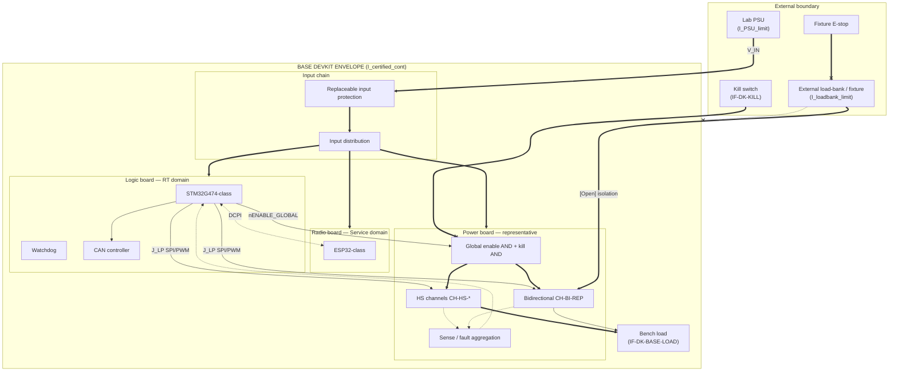
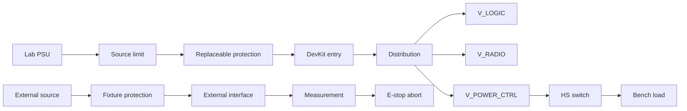
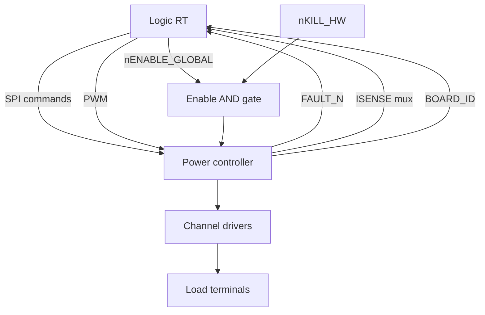
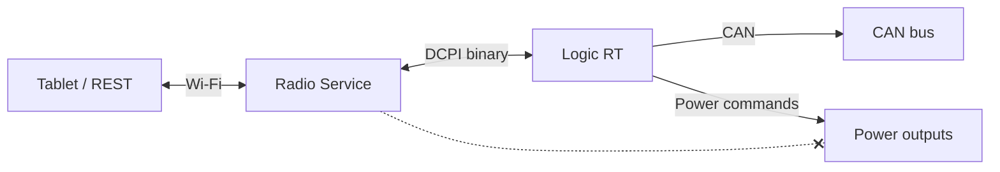
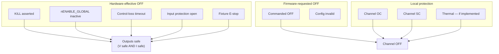
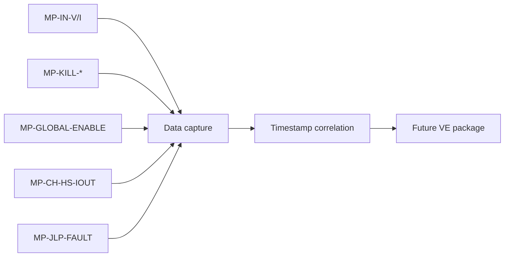

# DevKit Functional Block Diagram — WP-010

**Document ID:** DOC-DK-FBD-001  
**Version:** 1.0  
**Status:** Proposed — requires Architecture Review  
**Work Package:** WP-010  
**Date:** 2026-07-20

Companion to [`DevKit_Functional_Electrical_Architecture.md`](DevKit_Functional_Electrical_Architecture.md). Diagrams are **not** substitutes for matrices.

## Legend

| Line style | Meaning |
|------------|---------|
| `==>` solid | Power / energy flow |
| `-->` dashed | Control flow |
| `-.->` dotted | Diagnostic / measurement flow |
| `==x` | Hardware safety path (kill / global disable) |
| `[Open]` | Unresolved architecture decision |

## 1. System overview

## 2. Energy flow (View A)

**Constraint:** Path K→M shall not back-feed D without explicit `[Open]` isolation design.

## 3. Control flow (View B)

## 4. Service flow (View C)

Service path (dotted-x) has **no direct** output enable authority.

## 5. Safety flow (View D) — independent paths

## 6. Measurement flow (View E)

## 7. Domain map (all major domains)

| Domain | Block in §1 |
|--------|-------------|
| DOM-LAB-SUPPLY | PSU |
| DOM-INPUT-PROTECT | PROT |
| DOM-INPUT-DIST | DIST |
| DOM-LOGIC-PWR | LOGIC |
| DOM-RADIO | RADIO |
| DOM-PWR-CTRL | POWER / GLOB |
| DOM-HS-REP | HS |
| DOM-BI-REP | BI |
| DOM-SENSE-DIAG | SENSE |
| DOM-HW-KILL | KILL_SW → GLOB |
| DOM-GLOBAL-EN | GLOB |
| DOM-EXT-BANK | FIX |
| DOM-BENCH-LOAD | BENCH |
| DOM-DCPI | STM ↔ ESP |
| DOM-CAN | CAN |
| DOM-MEASURE | MP-* (see register) |
| DOM-FIXTURE-CTL | ESTOP |

## 8. Revision history

| Version | Date | Change |
|---------|------|--------|
| 1.0 | 2026-07-20 | WP-010 initial block diagrams — Proposed |
